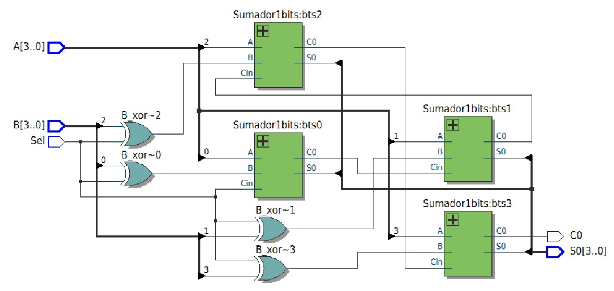

# Lab02 - Sumador/Restador de 4 bits

# Integrantes

# Informe

Indice:

1. [Documentación](#documentación-de-los-circuitos-implementados-implementado)
2. [Simulaciones](#simulaciones)
3. [Evidencias de implementación](#evidencias-de-implementación)
4. [Preguntas](#preguntas)
5. [Conclusiones](#conclusiones)
6. [Referencias](#referencias)

## Documentación del diseño implementado

### 1. Sumador/Restador

#### 1.1 Descripción

El diseño consiste en un circuito aritmético combinacional capaz de realizar sumas y restas de números binarios de 4 bits. La arquitectura se basa en el uso de Sumadores Completos (Full Adders) interconectados en cascada (Ripple Carry) y el aprovechamiento de las propiedades lógicas de la compuerta XOR para el manejo del sustraendo.

El sistema utiliza una señal de control denominada Sel:

* Suma (Sel = 0): Los bits de la entrada $B$ pasan sin cambios a través de las compuertas XOR. El acarreo inicial ($C_{in}$) del primer sumador es 0.

* Resta (Sel = 1): La señal Sel invierte los bits de $B$ (complemento a uno) y, al estar conectada al $C_{in}$ del primer sumador (bts0), suma un '1' menos significativo, completando así la operación de complemento a dos.

#### 1.2 Diagramas

El diseño jerárquico se divide en:Módulo Superior (Top): 

1. Sumador_Restador_4bits, que integra la lógica de control y las instancias de los sumadores.

2. Módulo Base: Sumador1bits, que implementa las funciones booleanas de la suma:

* $S_0 = (A \oplus B) \oplus C_{in}$

* $C_0 = (C_{in} \cdot (A \oplus B)) + (A \cdot B)$

## Simulaciones 

### 1. Simulación del sumador/restador

#### 1.1 Descripción

Para validar el código Verilog proporcionado, se analizan los flujos de señales internos definidos por los cables B_xor y los acarreos intermedios C1, C2, C3. La simulación verifica que ante una entrada $A$ y $B$, el resultado $S_0$ corresponda a la operación aritmética seleccionada por Sel.

#### 1.2 Diagrama

## Evidencias de implementación

El código fuente implementado en lenguaje de descripción de hardware (HDL) refleja una estructura modular. Se destaca la instanciación de cuatro bloques de un bit, asegurando que el acarreo de salida de una etapa sea el acarreo de entrada de la siguiente, formando la cadena de acarreo necesaria para la operación de 4 bits.

## Conclusiones

- **Versatilidad Lógica**: Se demostró que es posible reutilizar la infraestructura de un sumador para realizar restas mediante la implementación de la lógica de complemento a dos, optimizando el uso de recursos de hardware.

- **Modularidad**: La segmentación del diseño en módulos de 1 bit facilita la escalabilidad del sistema a palabras de mayor longitud (8, 16 o 32 bits).

- **Control de Acarreo**: El bit de salida C0 actúa como indicador de desbordamiento (overflow) en sumas sin signo o como bit de signo/acarreo final en operaciones de resta, cumpliendo con los estándares de la unidad aritmética lógica (ALU).

## Referencias
